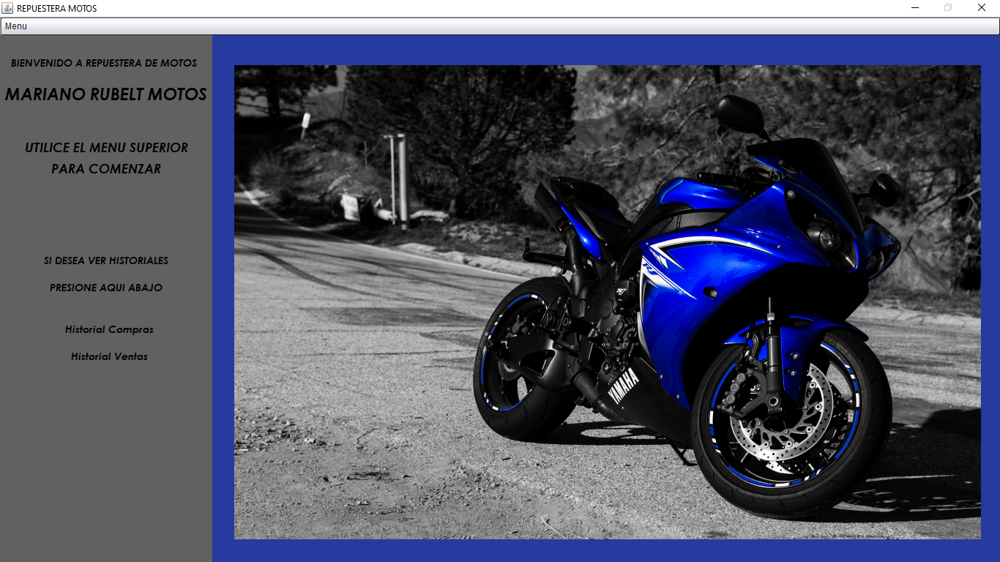
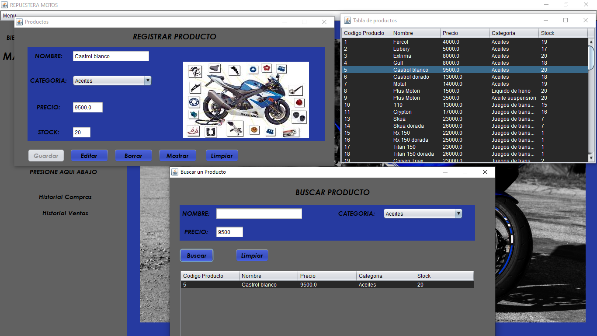
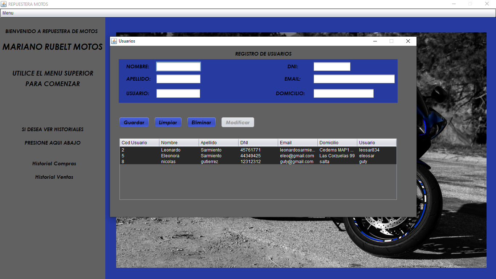
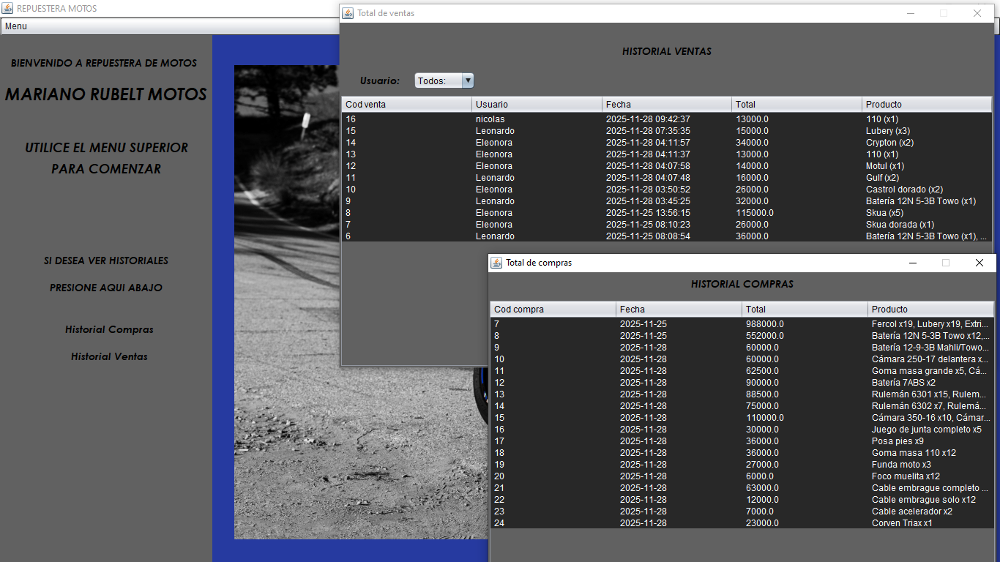

# 🏍️ Sistema de Gestión - Repuestera de Motos

Aplicación de escritorio desarrollada en Java para la gestión de un negocio de repuestos de motos.

El sistema permite administrar productos, usuarios, compras y ventas, facilitando el control del stock y el seguimiento de operaciones.

---
## 📌 Funcionalidades

### 🧾 Gestión de productos

- Alta, Baja, Modificación y Listado (ABML)

- Control de stock

- Asociación por categoría

- Validaciones en formularios

### 👤 Gestión de usuarios

- Registro de usuarios

- Edición y eliminación

- Datos: nombre, apellido, DNI, email, domicilio y usuario

### 🔍 Búsqueda de productos

- Filtro por nombre

- Filtro por categoría

- Consulta de precios y stock

  ### 💰 Ventas

- Registro de ventas

- Asociación de productos

- Historial con:

- Usuario

- Fecha

- Total

- Productos vendidos

### 🛒 Compras

- Registro de compras

- Actualización de stock

- Historial de compras con detalle

  

---

  

## 🖥️ Capturas del sistema

  

### Menú principal



### Gestión de productos y Busqueda de productos



### Gestión de usuarios


    
### Historial de ventas y compras
  


---

  

## 🧱 Estructura del proyecto

  

El sistema está organizado en paquetes siguiendo una separación por responsabilidades:

  

-  `conexion`: conexión a la base de datos

-  `modelo`: clases que representan las entidades

-  `control`: lógica de negocio

-  `interfaz`: interfaz gráfica (Java Swing)

-  `imagenes`: recursos visuales

  

---

  

## 🛠️ Tecnologías utilizadas

  

- Java

- Java Swing

- MySQL

- JDBC

  

---

  

## ⚙️ Cómo ejecutar el proyecto

  

1. Clonar el repositorio:

```bash
git  clone  https://github.com/leosar834/MarianoRubeltMotosJava.git
```

---
## 👤 Autor

[](https://github.com/leosar834/Neumatone_db#-autor)

Desarrollado por leoSar834

GitHub:  [https://github.com/leosar834](https://github.com/leosar834)

---

## 🖥 Catedra Programacion II